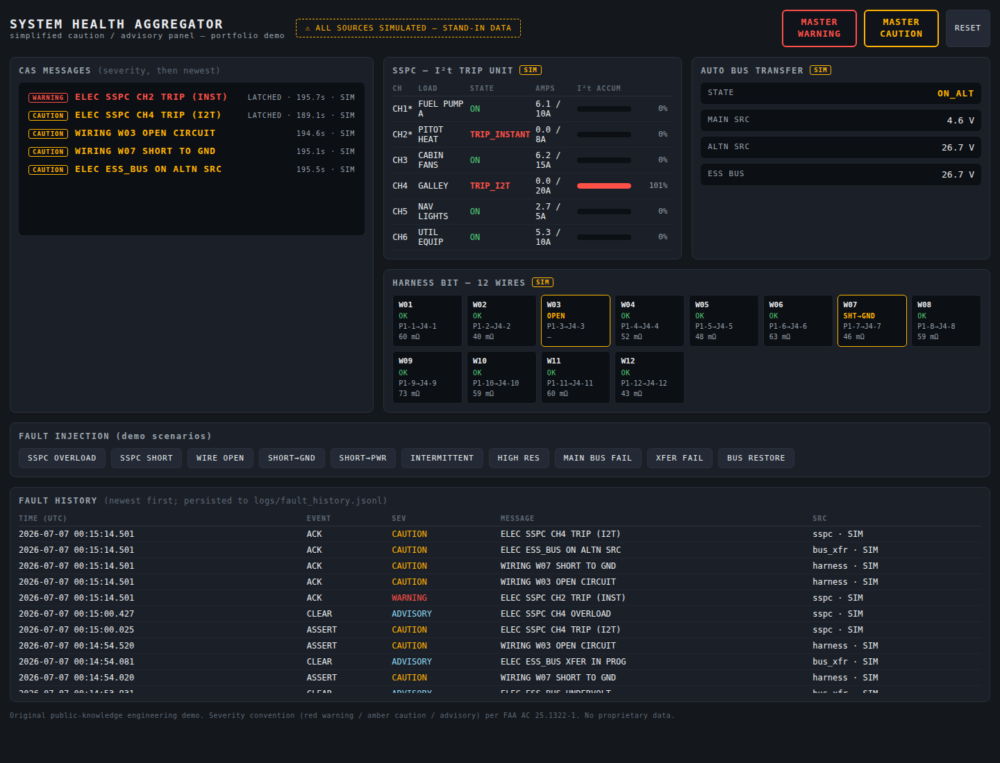

# System Health Aggregator — Simplified Caution/Advisory Panel

A dashboard that ingests fault/status signals from three electrical-system
modules — a solid-state power controller (SSPC) with I²t trip logic, a
wiring-harness fault-injection/continuity tester, and an automatic bus
transfer (ABT) controller — and annunciates them the way a simplified
aircraft caution/advisory system (CAS) would: prioritized by severity,
color-coded (red **warning** / amber **caution** / **advisory**), with master
annunciators, acknowledge/reset behaviour, and a timestamped fault-history
log.

**⚠ All three sources are SIMULATED stand-ins.** This repository contained no
existing SSPC, harness-tester, or bus-transfer project when this was built,
so each source is a behavioural simulation of what such a module would
realistically report (see `health_aggregator/sources/`). Every envelope,
UI tile, CAS message, and history entry is tagged `SIM` end to end so
simulated data can never masquerade as real data. Swapping in a real module
means reimplementing one `step()` method against real hardware or a serial
feed; the aggregator does not change.

This is original, public-knowledge engineering only. The severity convention
follows the publicly available FAA AC 25.1322-1 (red warning / amber caution
/ advisory). There are no proprietary bus labels, part numbers, fault-code
tables, or programme-specific values of any kind — all loads, thresholds,
and timings are generic textbook numbers.



## Quick start

Python 3.10+, no dependencies:

```
python3 run.py            # then open http://127.0.0.1:8000
python3 -m unittest discover -s tests    # 12 unit tests for the CAS core
```

Use the **fault injection** buttons to drive demo scenarios (SSPC overload →
watch the I²t accumulator charge and trip; main bus fail → watch the
undervolt advisory, transfer sequence, and ON ALTN caution; etc.). Click a
flashing master annunciator to acknowledge; **RESET** is a maintenance reset
that clears latched messages whose fault has gone and re-closes tripped
SSPCs.

## Architecture

```
sources (threads, level-based        aggregator (cas.py)              UI
status frames via queue.Queue)       one severity policy table   ┌────────────┐
┌─────────────┐  Envelope{source,    per-condition state machine │ CAS stack  │
│ SspcSim 10Hz│  channel,conditions, INACTIVE→PENDING(debounce)  │ masters    │
│ Harness 2Hz │─▶value,seq,t_mono,──▶ →ACTIVE→(clear/latch)     ─▶ tiles      │
│ BusXfr 20Hz │  t_wall,simulated}   history log (JSONL)         │ history    │
└─────────────┘                                                  └────────────┘
                                     HTTP: /api/state /api/history
                                     /api/ack /api/reset /api/inject
```

## Design decisions and why

Everything non-obvious, with the reasoning:

**Sources report facts; the aggregator owns severity.** A source envelope
carries raw condition flags (`SSPC_TRIP_I2T`, `HARNESS_SHORT_PWR`) and
telemetry — never a severity. All annunciation policy lives in one table
(`RULES` in `cas.py`). This mirrors how a real CAS/EICAS owns message
priority rather than each LRU deciding how alarming it is, and it means a
policy review (which faults are warnings?) touches exactly one file. It also
lets severity depend on context a single source can't see — e.g. an instant
trip is a WARNING on an *essential* channel and a CAUTION otherwise, decided
by a `severity_fn` in the rule, not by the SSPC.

**Level-based reporting, not edge-based events.** Every frame carries the
complete set of conditions currently true for that channel, rather than
sources emitting one-shot "fault occurred" events. Rationale: with events, a
lost message is a lost fault; with levels, a lost frame is just latency —
the next frame restores truth. It also makes the aggregator idempotent and
trivially restartable mid-flight. The cost (bandwidth) is irrelevant at
these rates. Transient facts that must survive being level-based are latched
*at the source* (SSPC trips stay tripped; the harness tester holds an
intermittent finding), which is exactly how the real hardware behaves.

**Debounce on assert *and* on clear.** Each rule has a persistence time a
condition must survive before annunciating (e.g. 500 ms for SSPC overload so
motor inrush never pages the crew; 1000 ms = two full scan cycles for a
harness open so one bad probe contact doesn't), and every non-latched
message must stay *cleared* for 500 ms before it is removed, so a chattering
fault can't strobe the panel. A dropout during the assert debounce restarts
the timer — persistence means *continuous* presence.

**Latching, and what RESET is allowed to do.** Trips, transfer failures,
hot shorts, and intermittents latch: their message survives the condition
clearing, because "it went away" is precisely the fault you must not lose
(especially intermittents). RESET deliberately refuses to clear a latched
message while its condition is still present — you cannot reset your way out
of an active fault. The UI shows a ✓ next to a latched message whose
underlying condition has cleared, so you can see it is safe to reset.

**Acknowledge silences the flasher, not the message.** Master WARNING /
CAUTION flash while any message at that level is unacknowledged; ack stops
the flashing but the annunciators stay lit and the messages stay displayed
while active. This is the standard master-caution pattern: the attention
getter is cancellable, the information is not.

**Severity mapping (the judgement calls):**

| Condition | Level | Why |
|---|---|---|
| Bus transfer FAIL | WARNING | essential bus unpowered, no automatic recovery left |
| Harness short-to-power | WARNING | hot short = energized conductor where it shouldn't be; fire risk outranks every other wiring fault |
| Instant trip, essential channel | WARNING | essential load just lost to a bolted short |
| I²t trip / instant trip non-essential | CAUTION | load lost, but thermally slow or non-essential; crew action is "subsequent," not immediate |
| On alternate source / open / short-to-ground | CAUTION | degraded but stable |
| Overload (pre-trip), high resistance, intermittent, transfer-in-progress, undervolt | ADVISORY | awareness / maintenance items |

**Simulation timing was chosen to exercise the aggregator honestly.** The
SSPC samples at 10 Hz; its I²t accumulator integrates (I²−Ir²)·dt above 110%
of rating, decays with a 30 s cooling time constant below it, and is sized
so a 200% overload trips in ~5 s (an inverse-time curve, like a thermal
breaker but repeatable); ≥8× rating trips instantaneously. The harness
scanner runs a full 12-wire continuity + insulation scan at 2 Hz, and
declares an intermittent after ≥3 dropouts in a 10 s window. The ABT runs at
**20 Hz because its dynamics are the fastest** — 100 ms undervolt
qualification and 150 ms break-before-make dead time would alias at 10 Hz.
The aggregator's 50 ms undervolt debounce is deliberately shorter than the
controller's own 100 ms qualification, so the advisory appears just before
the transfer sequence does.

**Stdlib-only Python + vanilla JS, and polling instead of SSE/websockets.**
The interesting part of this project is annunciation logic, not web
plumbing. Zero dependencies means it runs anywhere Python 3.10 exists — no
pip, no node, no build step — which is what you want for a portfolio demo
someone else will actually run. The UI polls `/api/state` at 2 Hz: human
reaction to a panel doesn't need better than 500 ms, polling is stateless
(a dropped poll self-heals on the next one, in keeping with the level-based
philosophy), and it avoids the reconnect/heartbeat machinery SSE or
websockets would add for no observable benefit at this scale.

**Injectable clock in the CAS core.** `CautionAdvisorySystem` takes a
`now_ms()` callable, so all twelve unit tests drive debounce, latch, clear,
and ack timing deterministically with a fake clock — no `sleep()`, no flaky
tests. Timing logic you can't test deterministically is timing logic you
don't actually know works.

**History is an append-only JSONL of transitions** (`ASSERT`, `CLEAR`,
`ACK`, `RESET`), not periodic state dumps: transitions are what you replay
during a post-test debrief, and JSONL survives crashes mid-write (worst case
you lose one line) and greps cleanly. Writing it is best-effort — a full
disk must never take down annunciation.

**Color is never the only channel.** Every CAS message carries a text
severity tag, every tile and message carries a `SIM` tag, and states are
written out (`TRIP_I2T`, `OPEN`, `ON_ALT`) next to their color. The
red/amber/cyan/green set was checked for color-vision-deficiency separation
and ≥3:1 contrast against the dark surface.

## Limitations (known, accepted)

- Single process, single panel; no redundancy, no source-failure detection
  (a silent source currently just goes stale — see interview Q3).
- No message inhibits by phase/mode (a real CAS suppresses cautions during
  engine start, takeoff, etc.).
- Simulated sources share the process; a real integration would ingest
  serial/CAN/UDP feeds through the same `Envelope`.

## How this would be challenged in an interview

Hard questions a hiring engineer might ask, and my best-attempt answers.

**Q1. "Your debounce delays annunciation of every fault. How do you justify
delaying a genuine warning by 250–1000 ms?"**
Debounce is per-rule, and it's zero for everything at warning level except
short-to-power. Trips and transfer failures annunciate on the first frame,
because the *source* already qualified them (the SSPC integrated I²t; the
ABT ran a 100 ms undervolt qualification) — re-debouncing a qualified fault
would be double-counting. Debounce is applied only where the raw measurement
itself is noisy (overload during inrush, continuity during probe chatter),
and there it *prevents* false annunciations, which are operationally
expensive: a crew — or an engineer — that has learned to ignore the panel is
worse than a panel that's 500 ms late. The 250 ms on short-to-power is the
one real trade; I'd defend it as one scan period of measurement confirmation
for the highest-consequence, lowest-prior-probability finding, and I'd
revisit it with real false-positive data.

**Q2. "Why did you put severity in the aggregator instead of letting each
source classify its own faults? The SSPC knows more about its trip than you
do."**
The SSPC knows everything about *its channel* and nothing about the
*aircraft*. Whether losing CH2 matters depends on what CH2 feeds, what else
has already failed, and what phase you're in — system-level context that
only the aggregator has. Concretely, the same `SSPC_TRIP_INSTANT` condition
maps to WARNING on an essential channel and CAUTION otherwise; if the source
chose, that policy would be duplicated (and would drift) across every
source's firmware. Centralizing it also gives one reviewable artifact —
the `RULES` table — which is how real programmes manage CAS message sets:
as a controlled document, not as opinions scattered across LRUs.

**Q3. "A source thread dies silently. What does your panel show, and is that
acceptable?"**
Today: the tile freezes with stale telemetry, active non-latched messages
from that source eventually... stay, actually — no new frames means
conditions are never marked absent, so the last-known messages persist. Data
just stops aging visibly. That's the honest gap: *stale data can look like
good data*, which in an annunciation system is the cardinal sin. The fix is
already half-built — every tile records `last_frame_ms` — so the aggregator
should watchdog each source and raise a synthesized `SRC XXX FAIL` caution
(fail-annunciated, like a real system flags an inop monitoring channel) when
a source misses N reporting periods. I'd treat this as the first
post-portfolio improvement, and the fact that the envelope carries both a
monotonic and a wall timestamp was chosen with exactly this in mind.

**Q4. "Your I²t model accumulates (I²−Ir²)·dt with an exponential decay on
cooling. What's wrong with that physically, and would you fly it?"**
It's a single-time-constant lumped thermal model of a wire, and real wire
protection is worse than that: the conductor and insulation heat at
different rates, ambient and bundle derating shift the trip curve, heating
and cooling time constants differ, and repeated overloads age insulation in
ways no I²t accumulator captures. Also, my accumulator only starts above
110% of rating, so sustained 109% loading — legal but hot — never registers.
Real SSPC trip curves are shaped to sit under the wire damage curve with
margin across the whole time axis, verified by test, not derived from one
τ. It's the right *behavioural* model for demonstrating annunciation logic;
nobody should fly it, including me.

**Q5. "Two warnings arrive in the same 100 ms. How does your system decide
what the crew sees first, and where does that break at scale?"**
Sorting is severity first, then age (oldest annunciated first within a
level), so the stack is stable — new messages don't reshuffle what someone
is reading, they append within their band. At this scale that's enough. It
breaks when a single root cause fans out: a main bus failure could
legitimately produce the undervolt advisory, the transfer caution, and a
dozen downstream equipment cautions within a second, and my panel would
faithfully display the flood instead of the cause. Real systems handle that
with inhibit/suppression logic (a parent message suppresses its known
children) and phase-of-flight inhibits, both of which are policy — meaning
they belong in exactly the rules table I already have, as
`suppresses: [...]` relationships. The architecture accommodates it; the
current rule set just doesn't populate it.

## Repository layout

```
run.py                          entry point
health_aggregator/
  envelope.py                   shared signal envelope + severity enum
  cas.py                        aggregator: RULES table, debounce/latch/ack, history
  server.py                     stdlib HTTP server + JSON API
  sources/                      SIMULATED stand-in sources (see module docstrings)
    sspc.py                     6-ch SSPC, I²t + instantaneous trip
    harness.py                  12-wire continuity/insulation scanner + intermittents
    bus_transfer.py             28 VDC main→alternate ABT state machine
  static/                       panel UI (vanilla HTML/CSS/JS, 2 Hz poll)
tests/test_cas.py               deterministic fake-clock tests of the CAS core
logs/fault_history.jsonl        created at runtime (gitignored)
```
